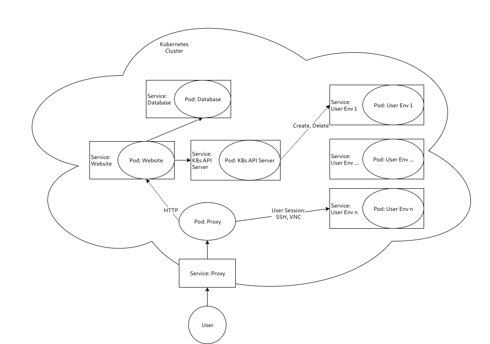

# Lawliet Hub
### This is the internal hub/API server for [Lawliet](https://github.com/cu-cybersecurity-club/lawliet)

## Description

The Lawliet Hub is Lawliet's one-stop-shop for interacting with Kubernetes. In it's current state, the Hub is primarily a wrapper on the Kubernetes API to isolate concerns and simplify the code of the frontend. It does provide an interface for performing manual or automated "cleanup" of pods in specified time ranges.

See [Lawliet](https://github.com/cu-cybersecurity-club/lawliet) for overall project details and motivation.

## Architecture
### Diagram


## Deploying the Hub

### WARNING: Please keep in mind that the deployment scripts customize the configuration of `kubelet` slightly to allow configuration of the `net.ipv6.conf.all.disable_ipv6` sysctl. 
Due to (potential) instability of configuration style for both Minikube and GCP/GKE deployments of `kubelet`, these scripts are liable to fail in the future.

### Local
Local development is encouraged on Minikube, although any deployment of Kubernetes should work. 
```
minikube start --cpus=4 --memory='4000mb'
./k8s/full_deploy_minikube.sh
```

### GCP
Create a GKE cluster, then:
```
./k8s/full_deploy.sh
```

### Post-Deployment
After some configuration and startup delay, you should be able to run `kubectl get service`, `kubectl get deployment`, and `kubectl get pod` to see the successful deployment of the Hub. It should be accessible (from within the cluster) at the service name: `lawliet-k8s-api-server`.

## Developing
Code for the Hub is located in `/k8s/api-server` along with documentation describing the role of each file. Code for deployment is located in `/k8s` and relevant documentation is attached. 

## Testing
Create a debug container with:
```
kubectl run debug -it --rm --restart=Never --image alpine -- sh
```

Within the container, run
```
apk add curl
```

You should now be able to `curl` the service by name: `curl lawliet-k8s-api-server`

## API Documentation

**Create Environment**
----

Creates a user environment by name.

* **URL**

  /container/:id

* **Method:**

  `PUT`
  
*  **URL Params**

   **Required:**
 
   `id=[string]`

* **Data Params**

  `ssh_key=[string]`

* **Success Response:**

  * **Code:** 200  
    **Content:** `{ "pod_name" : "lawliet-env-:id" }`
 
* **Error Response:**

  * **Code:** 500  
    **Content:** `{ "error" : "failed to create pod" }`

* **Sample Call:**

  ```
  curl -XPUT lawliet-k8s-api-server/container/test
  curl -XPUT lawliet-k8s-api-server/container/testssh \
		--data-urlencode "ssh_key=$(cat ~/.ssh/id_rsa.pub)"
  ```

**Get Environment**
----

Gets information about a user environment by name.

* **URL**

  /container/:id

* **Method:**

  `GET`
  
*  **URL Params**

   **Required:**
 
   `id=[string]`

* **Success Response:**

  * **Code:** 200  
    **Content:** 
	```
	{ 
		"name" : "lawliet-env-:id",
		"created": TIMESTAMP,
		"deleted": TIMESTAMP,
		"conditions": [
				"message": MESSAGE,
				"reason": REASON,
				"status": STATUS,
				"type": TYPE
		]
	}
	```

	See the Kubernetes API docs for the [API call](https://kubernetes.io/docs/reference/generated/kubernetes-api/v1.11/#read-status-pod-v1-core), [Pod response](https://kubernetes.io/docs/reference/generated/kubernetes-api/v1.11/#pod-v1-core), and [Pod status](https://kubernetes.io/docs/reference/generated/kubernetes-api/v1.11/#podstatus-v1-core) for the formatting and meaning of response fields.
 
* **Error Response:**

  * **Code:** 404  
    **Content:**
	```
	{ "name" : "lawliet-env-:id", "status": "NotFound" }
	```

  * **Code:** 500  
    **Content:** 
	```
	{ "error" : "failed to get pod status" }
	```

* **Sample Call:**

  ```
  curl -XGET lawliet-k8s-api-server/container/test
  ```

**Delete Environment**
----

Deletes an environment by id.

* **URL**

  /container/:id

* **Method:**

  `DELETE`
  
*  **URL Params**

   **Required:**
 
   `id=[string]`

* **Success Response:**

  * **Code:** 200  
    **Content:** ```{ "status" : "success" }```
 
* **Error Response:**

  * **Code:** 500  
    **Content:** `{ "error" : "failed to delete pod" }`

* **Sample Call:**

  ```
  curl -XDELETE lawliet-k8s-api-server/container/test
  ```


**Cleanup Environments**
----

Deletes all environments older than a specified amount of time.

* **URL**

  /container/cleanup

* **Method:**

  `POST`
  
* **Data Params**
   
   `minutes_alive=[integer]`: DEFAULT `minutes_alive=720`

* **Success Response:**

  * **Code:** 200  
    **Content:** `{ "status" : "success" }`
 
* **Error Response:**

  * **Code:** 500  
    **Content:**   
	```
	{ "error" : "cleanup deletion failed for at least one pod" }
	```  
	OR  
    **Content:** `{ "error" : "failed to get pods" }`

* **Sample Call:**

  ```
  curl -XPOST lawliet-k8s-api-server/container/cleanup \
		--data-urlencode "minutes_alive=720"
  ```


## Links and Notes from Development

### Why is IPv6 necessary? The Hack the Box VPN requires IPv6
[HTB Forum Post](https://forum.hackthebox.eu/discussion/385/fatal-error)

#### Containers
Docker containers must have IPv6 un-disabled (it is disabled by default) in order to run an IPv6 VPN. This is done by editing a sysctl, specifically `net.ipv6.conf.all.disable_ipv6`. Additionally, the container must have `NET_ADMIN` capability in order to open a tunnel. Additionally, containers must have the file `/dev/net/tun` in order to open a tunnel, which can be created (if it doesn't exist) by with the following commands:
```
mkdir -p /dev/net
mknod /dev/net/tun c 10 200
chmod 0666 /dev/net/tun
```
* [Docker and IPv6](https://docs.docker.com/v17.09/engine/userguide/networking/default_network/ipv6/#how-ipv6-works-on-docker)
* [OpenVPN and IPv6 in containers](https://github.com/dperson/openvpn-client/issues/75)
* [/dev/net/tun explanation Reddit post #1](https://www.reddit.com/r/docker/comments/bog7gy/help_with_error_cannot_open_tuntap_dev_devnettun/)
* [/dev/net/tun explanation Reddit post #2](https://www.reddit.com/r/docker/comments/4cw758/accessing_tuntap_device_inside_of_a_docker/)
* [/dev/net/tun creation issue](https://github.com/haugene/docker-transmission-openvpn/issues/538)
* [/dev/net/tun creation code](https://github.com/haugene/docker-transmission-openvpn/blob/dev/openvpn/start.sh#L8)

#### Docker Daemon (only if non-Kubernetes)
If running the non-Kubernetes deployment (pure Docker), the Docker daemon must also have [IPv6 enabled](https://docs.docker.com/config/daemon/ipv6/).

### Security Concerns
I think that because the network is in bridge mode, there shouldn't (?) be a vuln, though this may require creating networks for every container? DONT RUN IN HOST NETWORK MODE otherwise definitely a vuln

Various resources for understanding container and Kubernetes security better -- particularly relevant considering that we're trying to give everyone unfettered access to their own container with all the pentesting tools they could want :)

    https://blog.trailofbits.com/2019/07/19/understanding-docker-container-escapes/
    https://github.com/IanColdwater/kubernetes-security-best-practice
    https://www.cyberark.com/threat-research-blog/the-route-to-root-container-escape-using-kernel-exploitation/
    https://www.cyberark.com/threat-research-blog/how-i-hacked-play-with-docker-and-remotely-ran-code-on-the-host/
